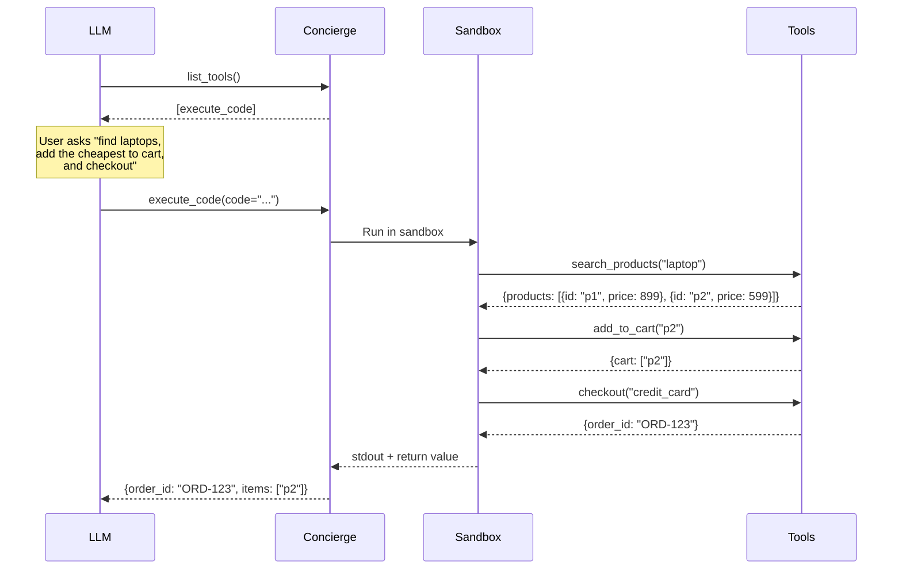

The **Code** backend gives the LLM one meta-tool: `execute_code(code, timeout)`. The LLM writes an async Python script that calls your tools directly. One turn can do the work of many.

## Setup

```python
from concierge import Concierge, Config, ProviderType

app = Concierge(
    "my-server",
    config=Config(provider_type=ProviderType.CODE),
)
```

## How It Works



The LLM writes the entire workflow in one shot. Concierge runs it in a sandboxed environment.

## What the LLM Writes

```python
# Discover available tools
print(runtime.list_tools())
print(runtime.get_tool_info("search_products"))

# Execute a workflow
results = await tools.search_products(query="laptop")
cheapest = min(results["products"], key=lambda p: p["price"])

await tools.add_to_cart(product_id=cheapest["id"])
order = await tools.checkout(payment_method="credit_card")
print(order)
```

The LLM has access to two injected modules:

| Module | Purpose |
|--------|---------|
| `tools` | Every registered tool as an async callable:`await tools.my_tool(arg="value")` |
| `runtime` | Discovery: `list_tools()`, `get_tool_info(name)`, `search_tools(query)` |

## Why It's 98% Less Context

Compare the token cost:

<Tabs>
  <Tab title="Plain mode (5 turns)">
  ```
  Turn 1: list_tools → [50 tool definitions]          ~2000 tokens
  Turn 2: search_products(query="laptop")              ~2100 tokens (tools resent)
  Turn 3: add_to_cart(product_id="p2")                 ~2100 tokens
  Turn 4: checkout(payment_method="credit_card")       ~2100 tokens

  Total: ~8300 tokens across 4 turns
  ```
  </Tab>
  <Tab title="Code mode (1 turn)">
  ```
  Turn 1: execute_code(code="...")                     ~150 tokens

  Total: ~150 tokens in 1 turn
  ```
  </Tab>
</Tabs>

The savings come from: (1) only 1 tool definition sent instead of 50, (2) one turn instead of multiple, (3) no tool schemas resent on each turn.

## Sandbox Security

The code runs in a restricted environment:

| Blocked | Why |
|---------|-----|
| `import` | No external libraries |
| `eval`, `exec` | No dynamic code execution |
| `open`, file I/O | No filesystem access |
| `__builtins__` | Restricted to safe builtins only |

Default timeout is **30 seconds**. Configurable per call.

<Note>
The sandbox only exposes your registered tools via the `tools` module. The agent cannot access anything outside what you've explicitly defined.
</Note>

## When to Use

<Tip>
Use Code when the LLM needs to do complex logic:conditionals, loops, sorting, filtering, or chaining many tools together.
</Tip>

**Good fit:**
- Complex workflows with conditionals (`if cheapest.price < 500: ...`)
- Batch operations (loop over items)
- Maximum cost efficiency
- Chaining 3+ tools in sequence

**Bad fit:**
- LLMs that struggle with code generation (smaller models)
- Simple one-tool calls (Plain is simpler)
- When you need human-readable execution logs (Plan is more auditable)
