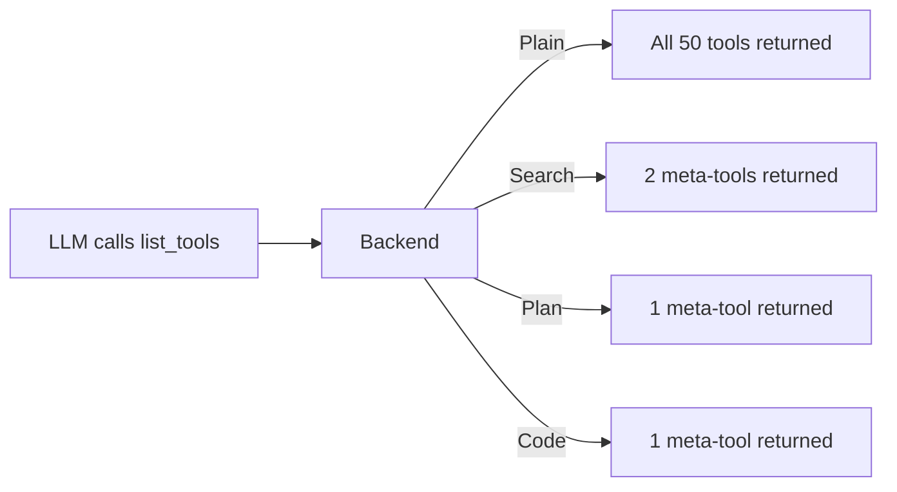

A **backend** (also called a provider mode) controls **how your tools are presented to the LLM**. It sits between the agent and your tools, deciding what the LLM sees and how it invokes them.

## Why Backends Matter

When an LLM connects to your MCP server, it calls `list_tools()` to discover what's available. The backend determines what comes back:



The choice of backend directly affects:

| Factor | Impact |
|--------|--------|
| **Token cost** | More tools in context = more tokens per request |
| **Accuracy** | Fewer choices = LLM picks the right tool more often |
| **Determinism** | Structured execution = more predictable outcomes |
| **Composability** | Code/Plan modes let the LLM chain tools in a single turn |

## Available Backends

<CardGroup cols={2}>
  <Card title="Plain" icon="list" href="/backends/plain">
    All tools exposed directly. Simple, no wrapping. Best for small APIs.
  </Card>
  <Card title="Search" icon="search" href="/backends/search">
    Semantic search over tools. Agent discovers then calls. Best for large APIs.
  </Card>
  <Card title="Plan" icon="list-ordered" href="/backends/plan">
    Agent submits a JSON execution plan. Sequential steps with data passing. Best for workflows.
  </Card>
  <Card title="Code" icon="terminal" href="/backends/code">
    Agent writes Python to call tools. Maximum efficiency. Best for complex logic.
  </Card>
</CardGroup>

## Configuring a Backend

```python
from concierge import Concierge, Config, ProviderType

# Default:Plain
app = Concierge("my-server")

# Explicit
app = Concierge(
    "my-server",
    config=Config(provider_type=ProviderType.SEARCH),
)
```

The default is `Plain`. Change it by passing `ProviderType.SEARCH`, `ProviderType.PLAN`, or `ProviderType.CODE`.

## Comparison

| Backend | LLM sees | Context cost | Best for |
|---------|----------|-------------|----------|
| **Plain** | All tools directly | High | Under 20 tools |
| **Search** | `search_tools` + `call_tool` | Medium | 100+ tools |
| **Plan** | `execute_plan` | Low | Multi-step workflows |
| **Code** | `execute_code` | Minimal | Complex logic, iteration |

## Backends + Stages

Backends work **on top of** stages. If you define stages, the backend only operates on the tools visible in the current stage:not all tools:

```python
app = Concierge(
    "my-server",
    config=Config(provider_type=ProviderType.CODE),
)

app.stages = {"browse": ["search"], "checkout": ["pay"]}
app.transitions = {"browse": ["checkout"], "checkout": []}
```

In the `browse` stage with Code mode, `tools.pay()` raises an error:it's only available after transitioning to `checkout`.
