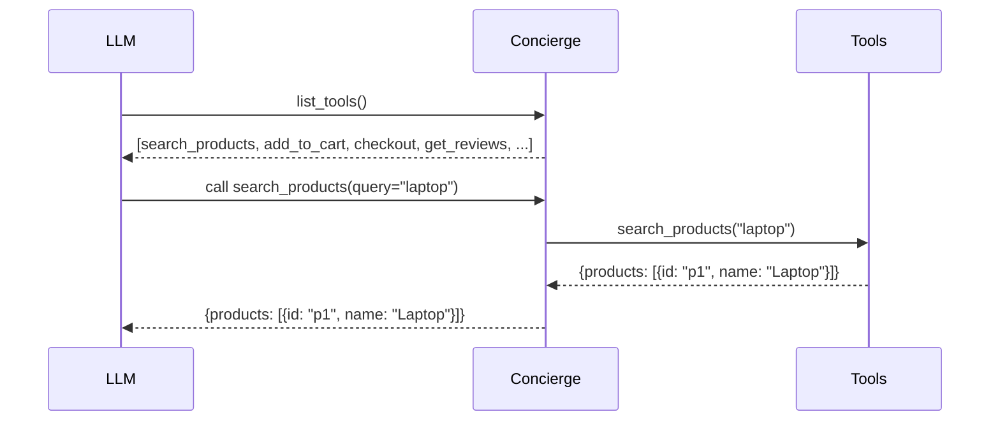

The **Plain** backend is the default. Every tool you register is exposed directly:the LLM sees all of them and calls them by name.

## Setup

```python
from concierge import Concierge

app = Concierge("my-server")
# That's it:Plain is the default
```

## How It Works



The LLM receives the full list of tools with their names, descriptions, and parameter schemas. It picks one, provides arguments, and Concierge routes the call to your function.

## What the LLM Sees

For a server with 3 tools, the LLM's tool list looks like:

```json
[
  {
    "name": "search_products",
    "description": "Search the product catalog by keyword.",
    "inputSchema": {
      "type": "object",
      "properties": {
        "query": {"type": "string"},
        "max_results": {"type": "integer", "default": 10}
      },
      "required": ["query"]
    }
  },
  {
    "name": "add_to_cart",
    "description": "Add a product to the shopping cart.",
    "inputSchema": { ... }
  },
  {
    "name": "checkout",
    "description": "Complete the purchase.",
    "inputSchema": { ... }
  }
]
```

Each tool definition consumes tokens. With 50 tools, this can be **thousands of tokens per turn**.

## When to Use

<Tip>
Use Plain when you have a small, focused API:under 20 tools:where every tool is potentially relevant at any point.
</Tip>

**Good fit:**
- Simple servers with few tools
- Tools that are all equally relevant at any time
- Quick prototyping before adding structure

**Bad fit:**
- 50+ tools (context bloat)
- Workflows with ordering requirements (use stages)
- Cost-sensitive applications (use Code or Plan)

## Example

```python
from concierge import Concierge

app = Concierge("weather")

@app.tool()
def get_forecast(city: str, days: int = 3) -> dict:
    """Get weather forecast for a city."""
    return {"city": city, "forecast": [{"day": 1, "temp": 72}]}

@app.tool()
def get_alerts(region: str) -> dict:
    """Get active weather alerts for a region."""
    return {"alerts": []}
```

The LLM sees both tools and picks whichever is appropriate for the user's question.
