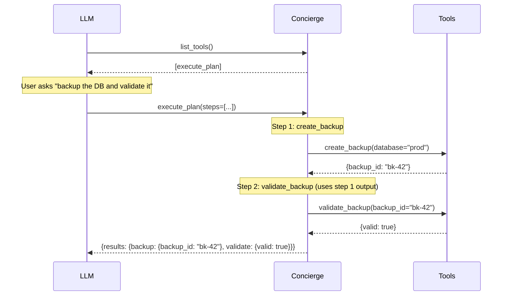

The **Plan** backend gives the LLM one meta-tool: `execute_plan(steps)`. The LLM submits a JSON plan:a list of steps that execute sequentially, with later steps able to reference earlier results.

## Setup

```python
from concierge import Concierge, Config, ProviderType

app = Concierge(
    "my-server",
    config=Config(provider_type=ProviderType.PLAN),
)
```

## How It Works



One LLM turn executes multiple tools in sequence. The LLM plans upfront, Concierge executes deterministically.

## What the LLM Sends

```json
{
  "steps": [
    {
      "id": "backup",
      "tool": "create_backup",
      "args": {"database": "prod"}
    },
    {
      "id": "validate",
      "tool": "validate_backup",
      "args": {
        "backup_id": {
          "output_by_reference": {"backup": ["backup_id"]}
        }
      }
    }
  ]
}
```

The `output_by_reference` resolves to the output of a previous step. Here, `{"backup": ["backup_id"]}` means: take the `backup` step's result, then get `["backup_id"]` from it.

## Data Passing with Sharable

Only parameters annotated with `Sharable()` can receive referenced data:

```python
from typing import Annotated
from concierge.core.sharable import Sharable

@app.tool()
def validate_backup(backup_id: Annotated[str, Sharable()]) -> dict:
    """Validate a backup by ID."""
    return {"valid": True, "backup_id": backup_id}
```

<Warning>
Only backward references are allowed:a step can only reference steps that come before it. No cycles, no self-references.
</Warning>

## What the LLM Sees

A single tool:

```json
[
  {
    "name": "execute_plan",
    "description": "Execute a sequential plan of tool calls.",
    "inputSchema": {
      "properties": {
        "steps": {
          "type": "array",
          "items": {
            "type": "object",
            "properties": {
              "id": {"type": "string"},
              "tool": {"type": "string"},
              "args": {"type": "object"}
            }
          }
        }
      }
    }
  }
]
```

## When to Use

<Tip>
Use Plan when your workflow involves multiple steps with data dependencies:the output of one tool feeds into the next.
</Tip>

**Good fit:**
- Multi-step workflows (backup → validate → migrate)
- Data pipelines where steps depend on previous results
- When you need deterministic, auditable execution

**Bad fit:**
- Simple single-tool calls (Plain is simpler)
- Conditional logic or loops (use Code)
- Dynamic workflows where the next step depends on runtime decisions
