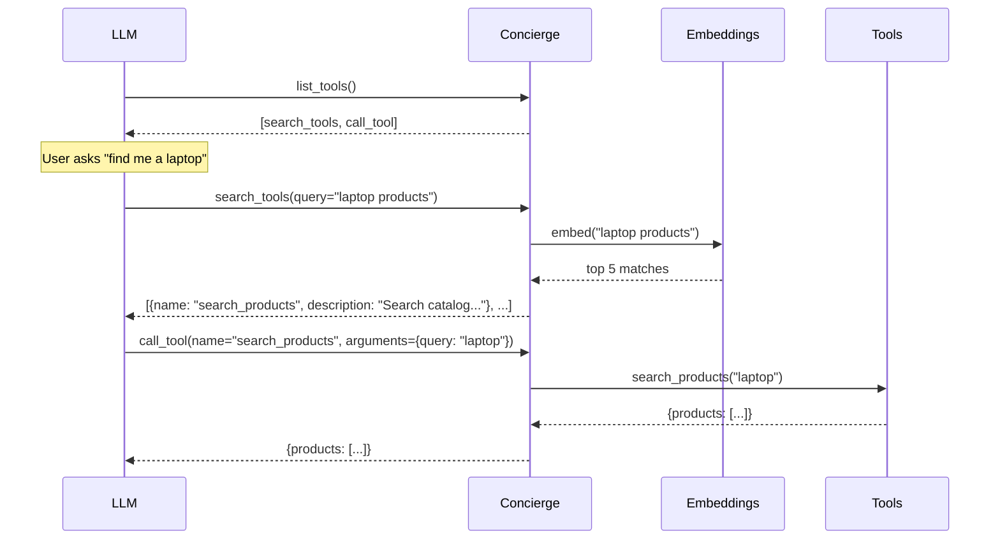

The **Search** backend gives the LLM two meta-tools: `search_tools(query)` to find relevant tools by description, and `call_tool(tool_name, arguments)` to invoke them. The LLM never sees your full tool list.

## Setup

```python
from concierge import Concierge, Config, ProviderType

app = Concierge(
    "my-server",
    config=Config(provider_type=ProviderType.SEARCH),
)
```

<Note>
Requires `sentence-transformers`. Install separately: `pip install sentence-transformers`
</Note>

## How It Works



The key difference: instead of seeing all 100+ tools upfront, the LLM **searches** for what it needs. This is like a developer searching an API reference instead of reading the entire docs.

## What the LLM Sees

Only two tools ever appear in the tool list:

```json
[
  {
    "name": "search_tools",
    "description": "Search available tools by description.",
    "inputSchema": {
      "properties": {
        "query": {"type": "string", "description": "What you're looking for"}
      }
    }
  },
  {
    "name": "call_tool",
    "description": "Call a tool by name with arguments.",
    "inputSchema": {
      "properties": {
        "tool_name": {"type": "string"},
        "arguments": {"type": "object"}
      }
    }
  }
]
```

Constant context cost regardless of how many tools you register:2 tool definitions instead of 200.

## Configuration

| Option | Default | Description |
|--------|---------|-------------|
| `max_results` | `5` | Number of search results returned per query |
| `model` | `BAAI/bge-large-en-v1.5` | SentenceTransformer model for embeddings |

```python
from sentence_transformers import SentenceTransformer

app = Concierge(
    "my-server",
    config=Config(
        provider_type=ProviderType.SEARCH,
        max_results=10,
        model=SentenceTransformer("all-MiniLM-L6-v2"),
    ),
)
```

## When to Use

<Tip>
Use Search when you have a large API (100+ tools) where the LLM only needs a few tools per conversation.
</Tip>

**Good fit:**
- Large APIs with 100+ tools
- Tools with clear, descriptive names and docstrings
- Exploration-heavy use cases ("what can this server do?")

**Bad fit:**
- Small APIs (Plain is simpler)
- Strict ordering requirements (use stages)
- Latency-sensitive apps (embedding adds ~50ms per search)
