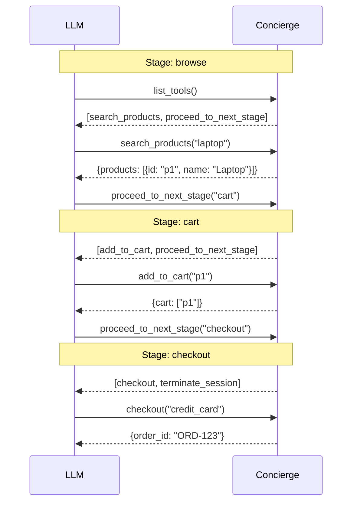

## Option A: Scaffold a New Project

<Steps>
  <Step title="Create the project">
  ```bash
  pip install concierge-sdk
  concierge init my-store
  cd my-store
  ```
  </Step>

  <Step title="Run it">
  ```bash
  python main.py
  ```
  Your MCP server is now running with staged workflows out of the box.
  </Step>
</Steps>

## Option B: Convert an Existing MCP Server

Already have a FastMCP server? Change one import:

```python
# Before
from mcp.server.fastmcp import FastMCP
app = FastMCP("my-server")

# After
from concierge import Concierge
app = Concierge("my-server")
```

All your existing `@app.tool()` decorators keep working. You've now got access to stages, transitions, state, and provider modes.

## Build a Shopping Workflow

Let's build an e-commerce flow with three stages: browse, cart, and checkout.

```python
from concierge import Concierge

app = Concierge("shopping")

# --- Tools ---

@app.tool()
def search_products(query: str) -> dict:
    """Search the product catalog."""
    return {"products": [
        {"id": "p1", "name": "Laptop", "price": 899},
        {"id": "p2", "name": "Mouse", "price": 29},
    ]}

@app.tool()
def add_to_cart(product_id: str) -> dict:
    """Add a product to the shopping cart."""
    cart = app.get_state("cart", [])
    cart.append(product_id)
    app.set_state("cart", cart)
    return {"cart": cart}

@app.tool()
def checkout(payment_method: str) -> dict:
    """Complete the purchase."""
    cart = app.get_state("cart", [])
    return {"order_id": "ORD-123", "items": cart}

# --- Stages ---
# Group tools into named stages. The LLM only sees tools
# in the current stage, not all tools at once.

app.stages = {
    "browse": ["search_products"],
    "cart": ["add_to_cart"],
    "checkout": ["checkout"],
}

# --- Transitions ---
# Define which stages can move to which. This enforces
# ordering so the LLM can't skip steps or go backwards
# unless you explicitly allow it.

app.transitions = {
    "browse": ["cart"],
    "cart": ["browse", "checkout"],
    "checkout": [],  # terminal stage, workflow ends here
}
```

### What Happens at Runtime



<Tip>
Notice the LLM only sees **1-2 tools per stage** instead of all 3 at once. At scale (50+ tools), this dramatically improves reliability and reduces costs.
</Tip>

## Add a Provider Mode

Want to reduce context even further? Switch to **code mode**:the agent writes Python instead of making individual tool calls:

```python
from concierge import Concierge, Config, ProviderType

app = Concierge(
    "shopping",
    config=Config(provider_type=ProviderType.CODE),
)
```

Now the LLM sees a single `execute_code` tool and writes scripts like:

```python
results = await tools.search_products(query="laptop")
await tools.add_to_cart(product_id=results["products"][0]["id"])
order = await tools.checkout(payment_method="credit_card")
print(order)
```

## Deploy

```bash
concierge deploy
```

Your server gets a public URL and appears in the [Concierge Platform](https://getconcierge.app) with logs, analytics, and evaluation.

## Next Steps

<CardGroup cols={2}>
  <Card title="Transitions" icon="git-branch" href="/sdk/transitions">
    Deep dive into stages and transitions
  </Card>
  <Card title="State" icon="database" href="/sdk/state">
    Learn about persistent session state
  </Card>
  <Card title="Backends" icon="layers" href="/backends/index">
    Plain, Search, Plan, and Code execution modes
  </Card>
  <Card title="Platform" icon="layout-dashboard" href="/platform/inspector">
    Inspector, logs, evaluation, analytics
  </Card>
</CardGroup>
