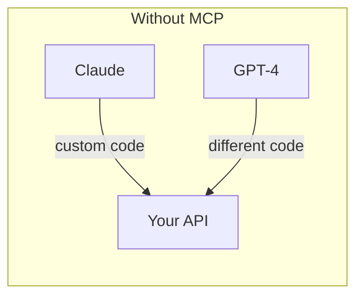
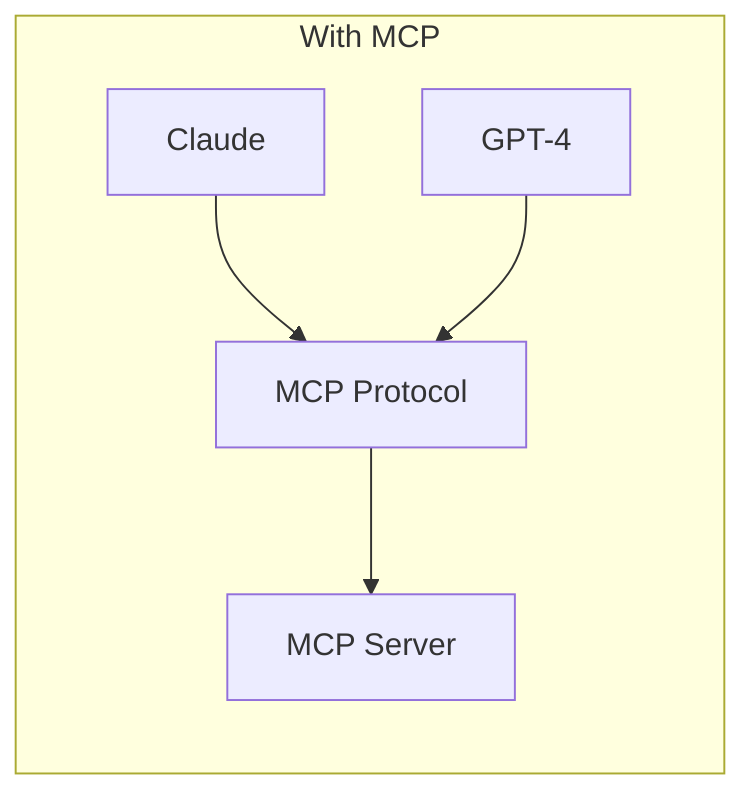
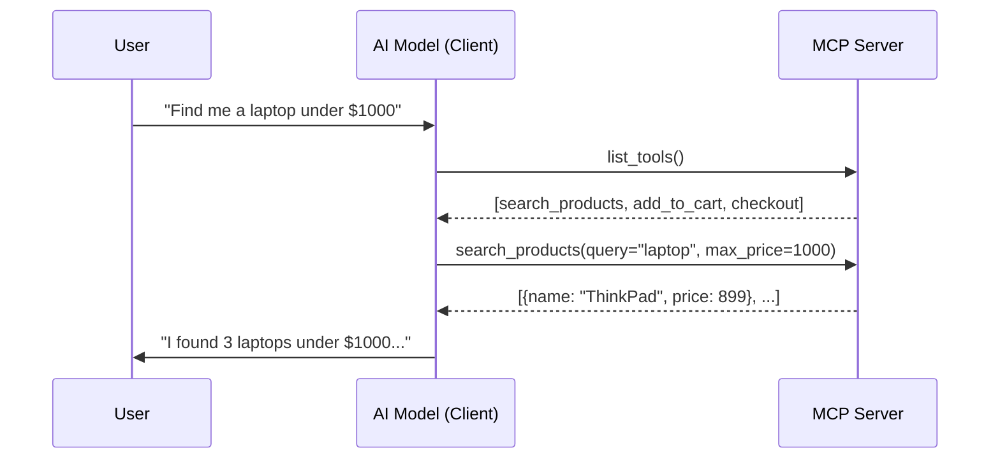

## What is MCP?

The **Model Context Protocol (MCP)** is an open standard introduced by Anthropic in late 2024 for connecting AI models to external tools, data sources, and environments. Think of it as a **USB-C port for AI**:a universal interface that lets any LLM talk to any service.

<Info>
MCP is to AI tools what HTTP is to the web:a shared protocol that means you build once and work everywhere.
</Info>

### The Problem MCP Solves

Before MCP, every AI integration was custom. Each LLM needed its own glue code to talk to your API.

Build one MCP server, and **every MCP-compatible client** (Claude Desktop, Cursor, Windsurf, your own apps) can use it.

### How MCP Works

MCP has three core primitives:

| Primitive | What it does | Example |
|-----------|-------------|---------|
| **Tools** | Functions the LLM can call | `search_products(query)`, `send_email(to, body)` |
| **Resources** | Read-only data the LLM can access | Database schemas, config files, API docs |
| **Prompts** | Reusable message templates | "Summarize this document", "Write a SQL query for..." |

### Transport Options

MCP servers communicate with clients using:

- **stdio**: local process communication (fastest, great for dev)
- **HTTP/SSE**: remote communication over HTTP (great for deployment)
- **Streamable HTTP**: latest spec for bidirectional streaming

### What Can You Build?

<CardGroup cols={2}>
  <Card title="AI-Powered APIs" icon="plug">
    Wrap any REST API, database, or service as an MCP server so LLMs can interact with it naturally.
  </Card>
  <Card title="Workflow Automation" icon="git-branch">
    Build multi-step workflows (e-commerce, onboarding, data pipelines) where the AI follows a defined path.
  </Card>
  <Card title="Internal Tools" icon="wrench">
    Give employees an AI assistant that can search docs, query databases, file tickets, and more.
  </Card>
  <Card title="AI-Native Apps" icon="bot">
    Build applications where the AI is the primary interface, backed by MCP server capabilities.
  </Card>
</CardGroup>

## Why Not Just Use a Plain MCP Server?

Plain MCP servers work great for simple cases. But as your tool count grows, problems emerge:

| Problem | What happens | Impact |
|---------|-------------|--------|
| **Context bloat** | All tools sent to the LLM every turn | Higher costs, slower responses |
| **Wrong tool selection** | LLM picks `delete_user` when it should pick `search_user` | Dangerous in production |
| **No ordering** | LLM can call `checkout` before `add_to_cart` | Broken workflows |
| **No session state** | Each tool call is stateless | Can't build multi-step flows |

**This is where Concierge comes in.** It adds the missing primitives (stages, transitions, state, and provider modes) to make MCP servers production-ready.

<Card title="What is Concierge?" icon="arrow-right" href="/home/what-is-concierge">
  Learn how Concierge solves these problems →
</Card>
