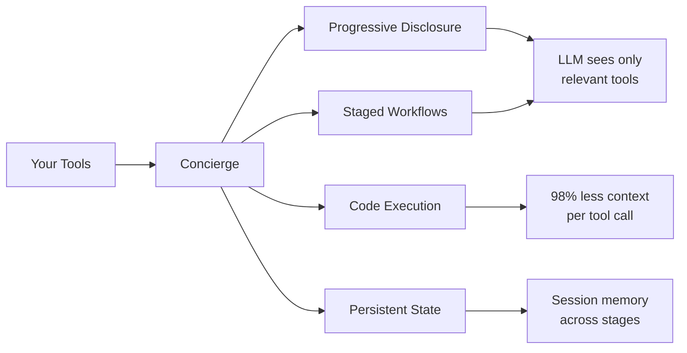
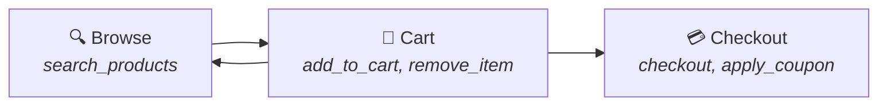

## The Problem

Standard MCP servers expose **every tool at once**. For a server with 50 tools, the LLM receives all 50 tool definitions on every single turn, even if only 3 are relevant right now. This causes:

- **Wasted tokens**: 80%+ of the context window is irrelevant tool schemas
- **Poor tool selection**: the LLM frequently picks the wrong tool
- **No guardrails**: nothing prevents calling `checkout` before `add_to_cart`
- **No state**: the server has no awareness of previous tool executions or state changes between calls

## What Concierge Does

Concierge is a **production MCP framework** that wraps your tools with structure. It's a drop-in replacement for FastMCP that adds four capabilities:



### Progressive Tool Disclosure

Instead of dumping all tools at once, Concierge shows **only the tools relevant to the current stage**:

```
Standard MCP:    LLM sees 50 tools → picks wrong one → retry → retry → success
Concierge:       LLM sees 3 tools  → picks right one → success
```

### Staged Workflows

Define **stages** (groups of tools) and **transitions** (allowed paths between stages). The LLM can only move forward through your defined flow:



<Tip>
Concierge auto-generates a `proceed_to_next_stage` tool so the LLM can navigate between stages. The LLM can only transition to stages you've explicitly allowed.
</Tip>

### Code-Based Execution

Instead of calling tools one-by-one (each consuming context), the agent writes a **Python script** that calls multiple tools in sequence. One LLM turn does the work of many:

<Tabs>
  <Tab title="Without Code Mode (5 LLM turns)">
  ```
  Turn 1: search_products("laptop") → results
  Turn 2: get_details("p1") → details
  Turn 3: add_to_cart("p1") → cart
  Turn 4: apply_coupon("SAVE10") → discount
  Turn 5: checkout("credit_card") → order
  ```
  </Tab>
  <Tab title="With Code Mode (1 LLM turn)">
  ```python
  results = await tools.search_products(query="laptop")
  details = await tools.get_details(product_id=results[0]["id"])
  await tools.add_to_cart(product_id=details["id"])
  await tools.apply_coupon(code="SAVE10")
  order = await tools.checkout(payment_method="credit_card")
  print(order)
  ```
  </Tab>
</Tabs>

<Note>
Code mode runs in a **sandboxed environment**:no imports, no `eval`, no file access. Only your registered tools are available.
</Note>

### Persistent State

Per-session key-value storage that persists across stage transitions:

```python
# In the "browse" stage
app.set_state("viewed_products", ["p1", "p2"])

# Later, in the "checkout" stage
viewed = app.get_state("viewed_products", [])
```

State can be backed by **in-memory** storage (default) or **Postgres** for distributed deployments.

## How It Compares

| Feature | Plain MCP | Concierge |
|---------|-----------|-----------|
| Tool exposure | All at once | Progressive per-stage |
| Ordering | None | Enforced transitions |
| Session state | None | Built-in key-value store |
| Context usage | High | Minimal (code mode) |
| Reliability | LLM-dependent | Deterministic flows |
| Migration effort | N/A | One-line import swap |

## One-Line Migration

```python
# Before:plain MCP
from mcp.server.fastmcp import FastMCP
app = FastMCP("my-server")

# After:Concierge (all existing @app.tool() decorators keep working)
from concierge import Concierge
app = Concierge("my-server")
```

<Card title="Get Started" icon="rocket" href="/getting-started/installation">
  Install Concierge and build your first staged workflow →
</Card>
