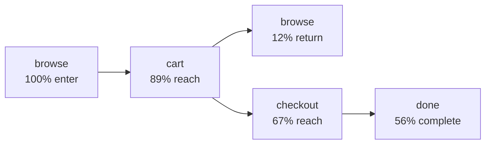

Real-time and historical metrics for your deployed MCP servers. Understand how your server is being used, identify bottlenecks, and spot errors before users report them.

## Dashboard Overview

Access analytics in the [Concierge Platform](https://getconcierge.app) after deploying your server with `concierge deploy`.

## Metrics Available

### Throughput

| Metric | Description |
|--------|-------------|
| **Requests/minute** | Total MCP requests across all sessions |
| **Active sessions** | Currently connected clients |
| **Peak concurrent** | Highest simultaneous session count |

### Tool Popularity

See which tools are called most frequently:

| Tool | Calls | Avg Time |
|------|-------|----------|
| search_products | 1,247 | 45ms |
| add_to_cart | 891 | 12ms |
| proceed_to_next_stage | 756 | 3ms |
| checkout | 423 | 230ms |
| apply_coupon | 198 | 18ms |

<Tip>
Tools with high call counts but low stage transition rates may indicate the LLM is stuck:consider improving tool descriptions or adding guardrails.
</Tip>

### Error Rates

| Metric | Description |
|--------|-------------|
| **Error rate** | Percentage of tool calls that returned errors |
| **Error breakdown** | Errors grouped by tool, error type, and stage |
| **Error timeline** | When errors spike, correlated with deploys |

```
Error Rate: 2.3% (last 24h)

Top errors:
  checkout       → "Cart is empty" (67 occurrences)
  search_products → Timeout after 30s (12 occurrences)
  add_to_cart    → "Product not found" (8 occurrences)
```

### Success Rate

Track end-to-end workflow completion:

```
Workflow Completion (last 7 days):
  browse → cart:      89% of sessions
  cart → checkout:    67% of sessions
  checkout → done:    94% of sessions
  Full funnel:        56% of sessions
```

### Time-Based Usage

- **Hourly/daily/weekly** request volume
- **Peak hours** identification
- **Trend lines** for growth tracking
- **Latency percentiles** (p50, p95, p99) over time

## Stage Analytics

See how users flow through your staged workflows:



Identify where users drop off and optimize those stages.

## Alerts

Set up alerts in the platform for:
- Error rate exceeding a threshold
- Response time spikes
- Unusual traffic patterns
- Stage drop-off rate changes
