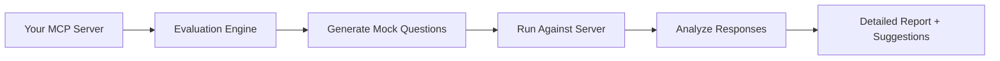

Evaluation lets you **automatically test your MCP server** by simulating real user interactions. It generates mock questions, runs them through your tools, and produces detailed reports with suggestions.

## How It Works



<Steps>
  <Step title="Deploy your server">
  Deploy your MCP server with `concierge deploy`.
  </Step>

  <Step title="Run evaluation">
  Launch an evaluation from the [Concierge Platform](https://getconcierge.app). Configure the LLM provider, model, and number of mock interactions.
  </Step>

  <Step title="Review the report">
  Get a detailed breakdown of how your server handled each interaction.
  </Step>
</Steps>

## What Gets Evaluated

### Tool Selection Accuracy

Does the LLM pick the right tool for each question?

| Query | Tool Called | Result |
|-------|-----------|--------|
| "Find me a laptop" | search_products | Correct |
| "Add that to my cart" | add_to_cart | Correct |
| "What's in my cart?" | search_products | Wrong (should be get_cart) |

### Stage Flow Compliance

Does the LLM follow the intended stage order?

| Flow | Result |
|------|--------|
| browse -> cart -> checkout | Correct |
| browse -> checkout | Skipped cart stage |

### Response Quality

Are tool responses useful and complete? The evaluator checks for missing fields, incomplete data, and unhelpful error messages.

### Error Handling

How does the server handle edge cases? For example, calling checkout with an empty cart, or passing an invalid product ID.

## Report Output

```json
{
  "summary": {
    "total_interactions": 20,
    "success_rate": 0.85,
    "avg_response_time_ms": 145,
    "stage_compliance": 0.95
  },
  "suggestions": [
    "Add a 'get_cart' tool: users frequently ask about cart contents",
    "checkout tool should validate cart is non-empty before processing",
    "search_products should handle empty query gracefully"
  ],
  "interactions": [...]
}
```

<Note>
Evaluation runs are non-destructive. They use the same MCP protocol as any client. No special server-side changes needed.
</Note>
