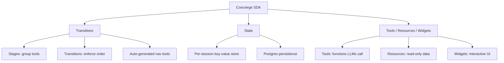

A Python framework that extends standard MCP servers with production capabilities. **Drop-in replacement** for FastMCP:change one import and you get:



## Quick Reference

```python
from concierge import Concierge, Config, ProviderType

# Create a server
app = Concierge("my-server")

# Register tools
@app.tool()
def my_tool(param: str) -> dict:
    return {"result": "done"}

# Define workflow stages
app.stages = {
    "step1": ["my_tool"],
    "step2": ["other_tool"],
}

# Define allowed transitions
app.transitions = {
    "step1": ["step2"],
    "step2": [],
}

# Use state across stages
app.set_state("key", "value")
value = app.get_state("key", "default")
```

## Sections

<CardGroup cols={2}>
  <Card title="Transitions" icon="git-branch" href="/sdk/transitions">
    Stages, transitions, and progressive tool disclosure
  </Card>
  <Card title="State" icon="database" href="/sdk/state">
    Per-session persistent state with snapshotting
  </Card>
  <Card title="Backends" icon="layers" href="/backends/index">
    Plain, Search, Plan, and Code execution modes
  </Card>
  <Card title="Tools" icon="wrench" href="/sdk/tools">
    Define and expose tools to AI agents
  </Card>
  <Card title="Resources" icon="file-text" href="/sdk/resources">
    Expose read-only data to clients
  </Card>
  <Card title="Widgets" icon="layout" href="/sdk/widgets">
    Interactive UI rendered in AI conversations
  </Card>
</CardGroup>
