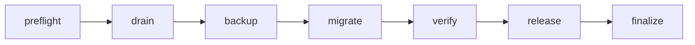
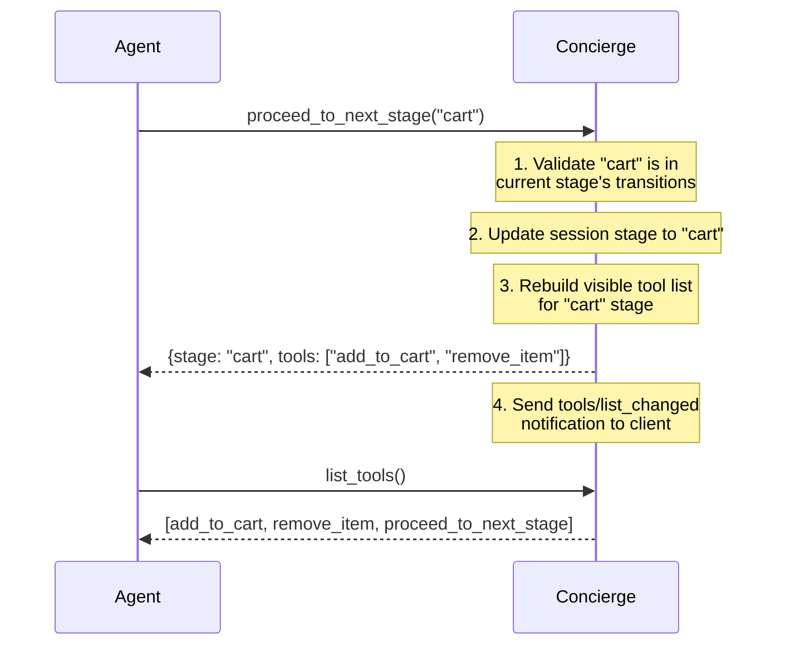
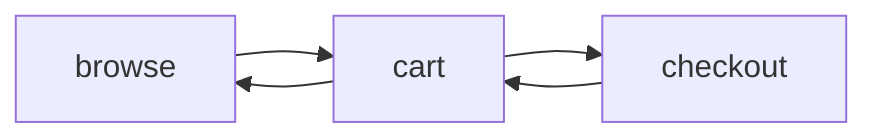

Transitions are the core of Concierge. They let you define **which tools the agent sees at each step** of a workflow, and **which steps it can move to next**.

## The Problem

A standard MCP server exposes all tools at once. With 30+ tools, the LLM:
- Wastes context on irrelevant tool schemas
- Picks the wrong tool more often
- Can call tools in the wrong order (e.g., `checkout` before `add_to_cart`)

## Stages as Tool Groups

At their core, stages are **tool groups**. You don't need transitions to use them. Even without defining any transitions, stages give you a powerful pattern: the LLM sees only the group names instead of every individual tool. When it selects a group, the tools inside that group are revealed.

This means a server with 50 tools doesn't dump all 50 into the context. Instead, the LLM sees 5 group names, picks the relevant one, and only then gets the 10 tools inside it.
```python
# No transitions needed. Just group your tools.
app.stages = {
    "search": ["search_products", "search_categories", "filter_results"],
    "account": ["get_profile", "update_profile", "change_password"],
    "orders": ["list_orders", "track_order", "cancel_order"],
    "support": ["create_ticket", "get_ticket_status"],
}
# The LLM sees 4 group names instead of 11 tool definitions
```

<Tip>
Even without transitions, tool groups reduce context size dramatically. The LLM loads only the tools it needs, when it needs them.
</Tip>

## Connected Stages with Transitions

When you add **transitions**, stages become a workflow. The LLM can only move between groups in the order you define, enforcing tool ordering and preventing invalid calls.

## Defining Stages

A **stage** is a named group of tools. When a session starts, the LLM only sees the tools in the first stage:

```python
app.stages = {
    "preflight": ["preflight_check"],           # LLM starts here
    "drain": ["drain_connections"],
    "backup": ["create_backup", "validate_backup"],
    "migrate": ["apply_migration"],
    "verify": ["run_smoke_tests"],
    "release": ["undrain_connections", "notify_stakeholders"],
    "finalize": ["finalize_migration"],
}
```

<Note>
The **first stage** defined is the default. When a session starts, the agent only sees tools from that stage.
</Note>

## How Transitions Work

**Transitions** define the allowed paths between stages:

```python
app.transitions = {
    "preflight": ["drain"],
    "drain": ["backup"],
    "backup": ["migrate"],
    "migrate": ["verify"],
    "verify": ["release"],
    "release": ["finalize"],
    "finalize": [],          # terminal:no further transitions
}
```



An empty list `[]` means the stage is **terminal**:the workflow ends there.

## Auto-Generated Tools

When stages are defined, Concierge automatically adds two tools:

| Tool | What it does |
|------|-------------|
| `proceed_to_next_stage(target_stage)` | Moves to a new stage. Only accepts stages listed in the current stage's transitions. Triggers a tool list refresh. |
| `terminate_session()` | Clears all session state and resets to the initial stage. |

<Warning>
`proceed_to_next_stage` enforces your transition rules. If the agent tries to jump to a stage not in the allowed list, it gets an error:not a silent failure.
</Warning>

## Under the Hood

Here's what happens when the agent calls `proceed_to_next_stage("cart")`:



The key insight: the MCP `tools/list_changed` notification tells the client to re-fetch the tool list. The agent now sees a completely different set of tools.

## Non-Linear Transitions

Transitions don't have to be linear. You can allow going back:

```python
app.transitions = {
    "browse": ["cart"],
    "cart": ["browse", "checkout"],  # can go back to browse
    "checkout": ["cart"],            # can go back to cart
}
```



## Combining with Provider Modes

Stages work **on top of** any provider mode. With code mode, the agent writes Python but can only call tools available in the current stage:

```python
from concierge import Concierge, Config, ProviderType

app = Concierge(
    "my-server",
    config=Config(provider_type=ProviderType.CODE),
)

app.stages = {"browse": ["search"], "checkout": ["pay"]}
app.transitions = {"browse": ["checkout"], "checkout": []}
```

In the `browse` stage, `tools.pay()` would raise an error:it's not available until the agent transitions to `checkout`.
