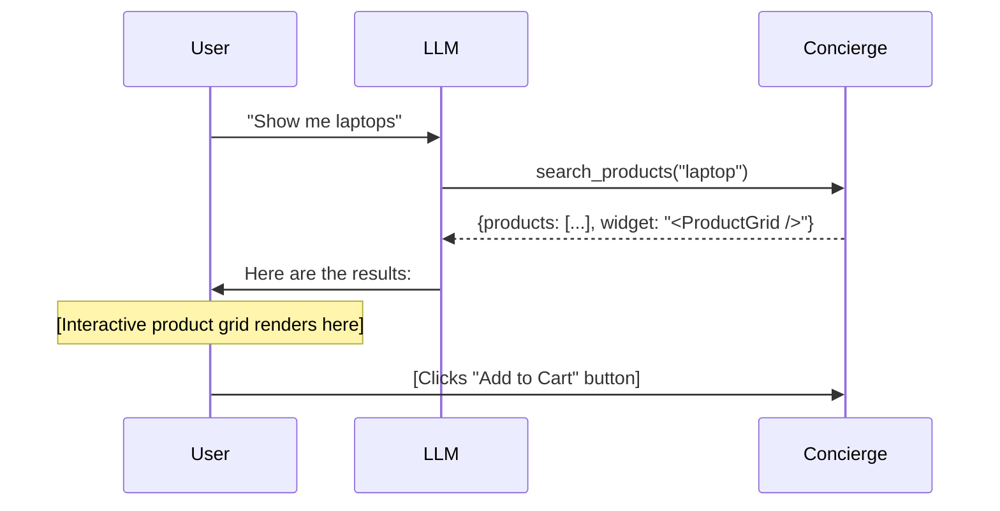

Widgets let your MCP server return **interactive UI** that renders directly inside the AI conversation. Instead of plain text, the user sees buttons, forms, charts, or any HTML/React component.

## How Widgets Work

When a tool returns a widget, the MCP client renders it inline:



## Defining Widgets

```python
@app.tool()
def show_products(query: str) -> dict:
    """Search and display products in an interactive grid."""
    products = db.search(query)
    return {
        "products": products,
        "_widget": {
            "type": "product-grid",
            "data": products,
        }
    }
```

<Note>
Widget support depends on the MCP client. Clients that don't support widgets will fall back to showing the raw JSON response.
</Note>

## Use Cases

<CardGroup cols={2}>
  <Card title="E-Commerce" icon="shopping-cart">
    Product grids, cart summaries, checkout forms with payment inputs.
  </Card>
  <Card title="Dashboards" icon="chart-bar">
    Real-time charts, KPI cards, data tables with sorting and filtering.
  </Card>
  <Card title="Forms" icon="file-input">
    Multi-step forms, file uploads, signature capture.
  </Card>
  <Card title="Maps" icon="map">
    Location pickers, route visualization, geospatial data display.
  </Card>
</CardGroup>

## Widgets + Stages

Widgets are especially powerful with staged workflows. Each stage can present a different UI:

| Stage | Widget | User sees |
|-------|--------|-----------|
| Browse | Product grid | Browsable catalog with filters |
| Cart | Cart summary | Items with quantities and remove buttons |
| Checkout | Payment form | Credit card input and order confirmation |
